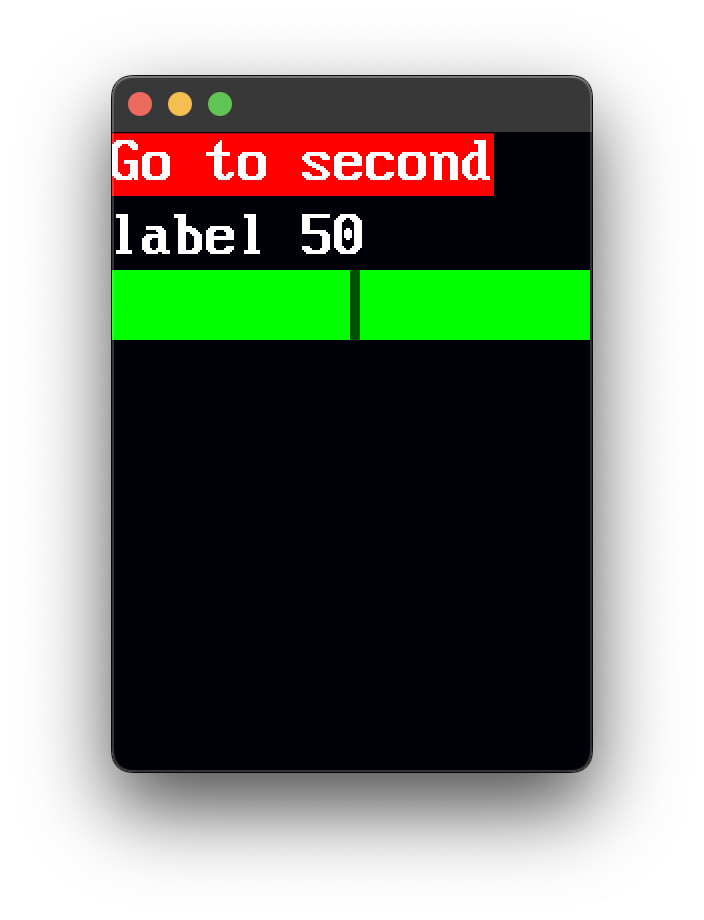
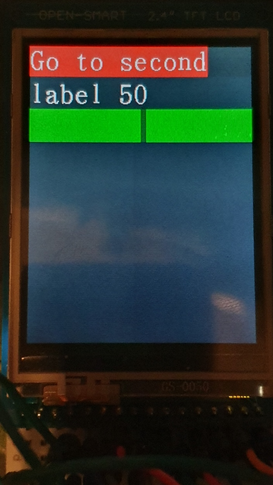

# UIVirtualizer

Small UI library for tft lcds and program to show ui before flashing to hardware display. This program depends on a driver for the esp using idf. 

- font: https://github.com/idispatch/raster-fonts/blob/master/font-16x32.c
- driver: https://github.com/nopnop2002/esp-idf-parallel-tft

Example screenshots, the ui was written and tested using the virtual display and pasted and flashed for the spfd5408. 

Virtual                    |  Physical
:-------------------------:|:-------------------------:
 |  

```c++
void ButtonCallback(int id)
{
    static int group = 0;
    group ^= 1;
    UISetGroup(group);
    UIWidgetGroupDraw();
}

int slider_value1 = 50;

void ui()
{
    style.button_color = GetColor(31, 0, 0);
    style.text_color = GetColor(31, 31, 31);
    style.font = fx32M;
    style.slider_bg_color = GetColor(0, 31, 0);
    style.slider_height = 35;
    style.slider_drag_color = GetColor(0, 10, 0);
    style.slider_drag_width = 5;
    style.spacing = (Vec2u8){5, 5};
    style.padding = 10;

    UIInit(&dev, &style);

    Vec2 size;
    size.x = 0;
    size.y = 0;

    UIBeginGroup();
    {
        UIButton("Go to second", ButtonCallback, size);
        UISlider("label %d", &slider_value1, 0, 100);
    }
    UIEndGroup();

    UIBeginGroup();
    {
        UIButton("Go to first", ButtonCallback, size);
        UIText("Information");
    }
    UIEndGroup();

    UISetGroup(0);
    UIWidgetGroupDraw();
}
```
